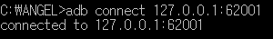
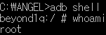

# ANGEL
This is a shell script used for collecting various information on Android devices

If you want to test on

    1) Nox Player:
    
    
    
    1. Check option to get Root privilege

    2. connect your Nox player
    

    3. execute shell
    
    
    As you can see you accessed shell with root

(Detailed explanation is needed regarding the license and script)

